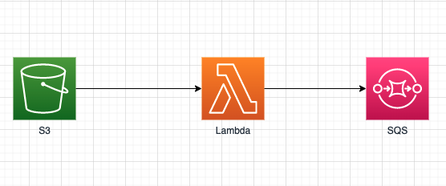
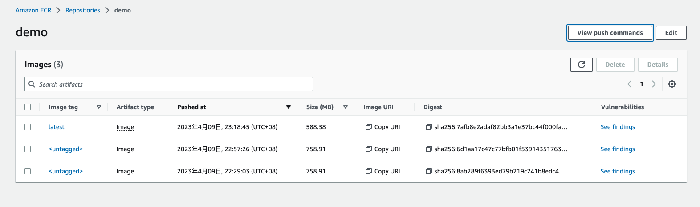
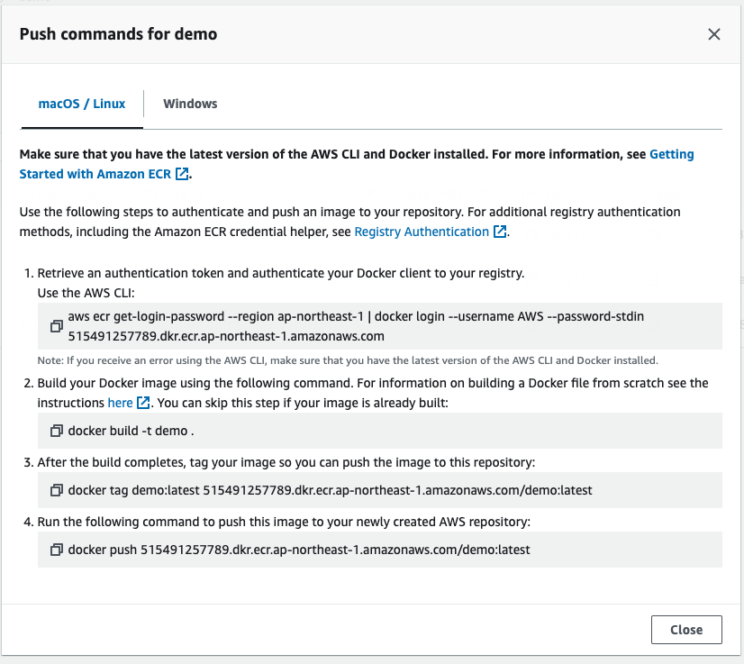
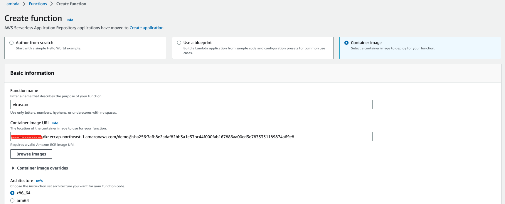
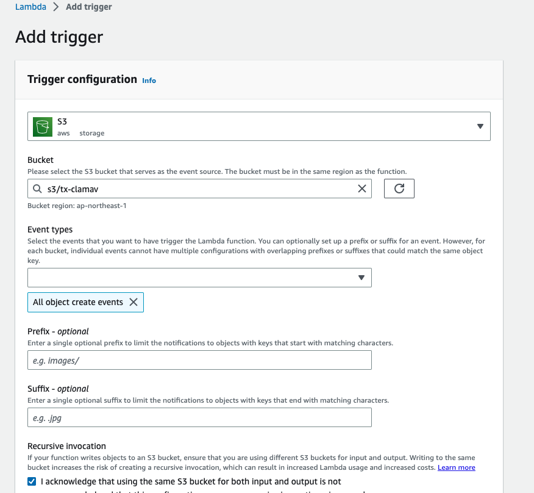
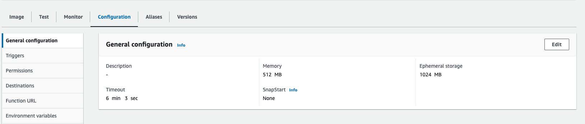

# 使用无服务器技术构建病毒检测服务
## 架构

1. 文件上传至s3
2. 通过s3 trigger 出发 lambda
3. Lambda 读取新上传的文件，调用 clamav 进行病毒木马扫描
4. Lambda 将结果发送的SQS ,供其他服务消费

## 部署过程
### 构建镜像
*由于lambda需要调用clamav， 所以我们需要一个基于容器的镜像，这里先构建这个镜像*
1. 在AWS ECR上创建 Repo
2. 在 EC2 环境中执行 Docker 打包 Image 命令（请提前在 EC2 中安装 Docker 环境）
```
docker build -t lambda-clamav .
```
3. 参考ECR控制台上的命令提示，将镜像推送的ecr repo中



### 构建Lambda 函数
1. 创建lambda函数，注意选择基于容器构建，如下图选择好你提交的镜像地址

1. 创建s3 触发器，当有新文件添加后，触发该lambda

1. 配置函数使用的内存和超时时间。由于文件扫描需要的时间较长，timeout 建议设置5分钟左右，内存至少512mb

